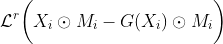
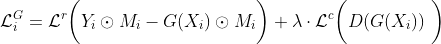

Author: [Ivan Bongiorni](https://www.linkedin.com/in/ivan-bongiorni-b8a583164/) | 2020-08-06

# Convolutional Recurrent Seq2seq with Adversarial Training for Missing Data Imputation of Time Series
Summary:
1. The dataset
2. Data processing
3. Models' architecture
4. Training
5. Results
6. Bibliography
---

## 1. The dataset
The Kaggle's Wikipedia [Web Traffic Time Series Forecasting](https://www.kaggle.com/c/web-traffic-time-series-forecasting) dataset contains ~145.000 time series on Wikipedia web traffic.
Its trends report daily visits to each web page.
While the main goal of the official Kaggle competition was to forecast future web traffic; this GitHub project can be thought as a spin-off (or maybe, a sequel) of that.
It is an effort of solving a major missing data problem that needs to be taken care of in order to produce proper forecasts.

## 2. Data processing
RNN layers require an input with shape:

`( number of observations , length of input sequences , number of variables )`

Every dataset is therefore a 3D tensor, with each batch of data being a slice of this larger object.
The length of each input sequence is an hyperparameter that was chosen manually; its value depends largely on the computational resources available.

Together with the actual trend to be imputed, a number of intervening variables have been employed.
First, data showed two strong yearly and quarterly seasonalities.
Because of this, two lag variables at  and  have been added to the input; this shortened the size of my dataset but increased its quality.

Additional variables, related to the kind of URL, have been extracted from raw data:
- `language`: English (`en`), Japanese (`ja`), German (`de`), French (`fr`), Chinese (`zh`), Russian (`ru`), Spanish (`es`); `na` for 'no language detected'.
- `website`: what type of website: `wikipedia`, `wikimedia`, `mediawiki`.
- `access`: type of access: `all-access`, `desktop`, `mobile-web`.
- `agent`: type of agent: `spider`, `all-agents`.

I also added two temporal variables:
- `weekdays`: float in `[0,1]` range for day in the week.
- `yeardays`: float in `[0,1]` range for day in the year.
I assumed the web traffic of some Wikipedia pages might be influenced by temperature and weather, or the simple occurrence of weekends.

After the removal of observations that originally came with NaN's, I have split my data "vertically": I reserved some whole trends to Train, Validation, and Test sets respectively.
No series present in one of these three subsets has any trace in the others. The reason for this choice is that the goal of this project is to be able to impute *real* missing observations as good as possible.
Therefore, I needed to test my model's ability to imput data from trends it had never seen before.

## 3. Models' architecture

I will first explain the architecture of the plain, Vanilla **seq2seq model**, since it constitutes the Generator in GAN models as well.

It is a Seq2seq Neural Network, with an Encoder part that is both recurrent and convolutional, and a fully recurrent Decoder.

The goal of the Encoder is to process the input signal. I assumed the LSTM layer (provided with a much higher number of parameters) would have done most of the job, with 1D Conv layer working as a support architecture.
I thought them as something similar to *skip connections*, that allow simpler signals to flow through the nodes of the Network more directly.
This is supposed to mitigate the main limitation of LSTM layers: their long-term dependency problem.
In more basic RNN architectures, some useful information located far away in the past must traverse all LSTM cells in a layer before reaching the output, making "older" information much harder to be used efficiently.
Conv layers are supposed to alleviate this problem, in a way similar to what Attention layers do.
Since many variables must be processed and combined, I stacked multiple Conv layers.
The outputs of the LSTM and 1D Conv layers are then stacked together and fed into the Decoder, that performs the final imputation.

In case of **GAN** models, I simply replicated all the Generators' architecture for the Discriminator. The only difference lies in the output nodes: the LSTM Decoder's output is fed into a Dense layer with one node and Sigmoid activation, working as a switch for its binary classification purpose.

## 4. Training

After running data pre-processing pipeline through `main_processing.py`, every Training, Validation and Test observation is stored on hard disk as a separate file. During training, to be launched from `main_train.py`, the script from `train.py` takes a trend and processes it, turning into a 3D matrix as explained above, and applying an artificial deterioration to the input batch. The way deterioration is generated is explained in [nan_exploration.ipynb notebook](https://github.com/IvanBongiorni/GAN-RNN_Timeseries-imputation/blob/master/nan_exploration.ipynb).

This artificial deterioration is applied randomly from `deterioration.py`, and consists of inserting missing values into the input batch. Their generation is explained in more detail in  After a given share of datapoints in the trend have been turned `NaN`'s, a **placeholder value** is added in their place. The choice of the placeholder value in relation with the choice of activation function is extremely important: the placeholder must tell the network where the data to be impute are, and therefore must be locate outside the meaningful range of my dataset. Since web traffic cannot possibly be lower than zero, I had to chose a placeholder values that was outiside the `[0, infinite]` range, and pair it with an activation function that is able to react to that peculiar value. Clearly, classical ReLU is not feasible, since any negative number passing through it will be flattened to zero. I then chose **ELU** activation, together with a placeholder of `-0.1`. In that way, a neural network is able to recognize what are the values to be substituted (imputed) during training.

#### Loss function
The basic **Seq2seq** model is trained with a "masked" regression Loss.
During training, artificial deterioration is produced from a randomly generated *mask matrix* .
This mask matrix contains 1's where the trend is deteriorated (i.e. where a missing value happens) and 0's where data remain intect.
The Imputer, or Generator 's Loss takes, for each artificially deteriorated batch  and its true counterpart , the following form:

where  is a plain regression Loss defined as Mean Absolute Error.
The purpose of each  is to make sure the model only learns to "fill the holes" in the input trend, instead of reconstructing a whole time series in general.

In the case of a simple **GAN**, instead, the Loss is a canonical Binary Cross-Entropy (BCE). **Label smoothing** is added to the Discriminator's BCE Loss, as a regularization technique.

More interesting is the case of the **Seq2seq model with partially adversarial training**.
In this case the Imputer (now defined as a GAN Generator) is trained on a Loss that combines the previous two, and defined as follows:

where  is the Imputer-Generator and  is the Discriminator.
This function is composed by a *regression component* , calculated as above as Mean Absolute Error (MAE), and a *classification*, or *adversarial component* , calculated as Binary Cross-Entropy (BCE).
Since the magnitude of the BCE loss exceeds its regressive counterpart, a weight hyperparameter  is used to shrink its impact.

### 5. Results

The three models have been compared, based on their performance on Test data. A more detailed exploration of their performances is avilable in [performance_comparison]((https://github.com/IvanBongiorni/GAN-RNN_Timeseries-imputation/blob/master/performance_comparison.ipynb)) Jupyter Notebook. The following kernel density plot represents a good summary of their comparison:

The vanilla Seq2seq models already achieves very good results, while a plain GAN, based exclusively on a Generator Vs Discriminator game is not able to reach acceptable performances. What is most interesting is the boost in performance that the Discriminator feedback adds to the partially adversarial model, compared to its vanilla counterpart. Partial GAN is proved to be superior.

## 6. Bibliography
- *Luo, Y., Cai, X., Zhang, Y., & Xu, J. (2018). Multivariate time series imputation with generative adversarial networks. In Advances in Neural Information Processing Systems (pp. 1596-1607).*
- *Yoon, J., Jordon, J., & Van Der Schaar, M. (2018). Gain: Missing data imputation using generative adversarial nets. arXiv preprint arXiv:1806.02920.*
- *Guo, Z., Wan, Y., & Ye, H. (2019). A data imputation method for multivariate time series based on generative adversarial network. Neurocomputing, 360, 185-197.*
- *Liu, Y., Yu, R., Zheng, S., Zhan, E., & Yue, Y. (2019). NAOMI: Non-autoregressive multiresolution sequence imputation. In Advances in Neural Information Processing Systems (pp. 11238-11248).*
- *Luo, Y., Zhang, Y., Cai, X., & Yuan, X. (2019, August). E2GAN: End-to-End Generative Adversarial Network for Multivariate Time Series Imputation. In Proceedings of the 28th International Joint Conference on Artificial Intelligence (pp. 3094-3100). AAAI Press.*
- *Suo, Q., Yao, L., Xun, G., Sun, J., & Zhang, A. (2019, June). Recurrent Imputation for Multivariate Time Series with Missing Values. In 2019 IEEE International Conference on Healthcare Informatics (ICHI) (pp. 1-3). IEEE.*
- *Tang, X., Yao, H., Sun, Y., Aggarwal, C. C., Mitra, P., & Wang, S. (2020). Joint Modeling of Local and Global Temporal Dynamics for Multivariate Time Series Forecasting with Missing Values. In AAAI (pp. 5956-5963).*
- *Zhang, J., Mu, X., Fang, J., & Yang, Y. (2019). Time Series Imputation via Integration of Revealed Information Based on the Residual Shortcut Connection. IEEE Access, 7, 102397-102405.*
- *Fortuin, V., Baranchuk, D., Rätsch, G., & Mandt, S. (2020, June). GP-VAE: Deep Probabilistic Time Series Imputation. In International Conference on Artificial Intelligence and Statistics (pp. 1651-1661).*
- *Huang, T., Chakraborty, P., & Sharma, A. (2020). Deep convolutional generative adversarial networks for traffic data imputation encoding time series as images. arXiv preprint arXiv:2005.04188.*
- *Huang, Y., Tang, Y., VanZwieten, J., & Liu, J. (2020). Reliable machine prognostic health management in the presence of missing data. Concurrency and Computation: Practice and Experience, e5762.*
- *Jun, E., Mulyadi, A. W., Choi, J., & Suk, H. I. (2020). Uncertainty-Gated Stochastic Sequential Model for EHR Mortality Prediction. arXiv preprint arXiv:2003.00655.*
- *Qi, M., Qin, J., Wu, Y., & Yang, Y. (2020). Imitative Non-Autoregressive Modeling for Trajectory Forecasting and Imputation. In Proceedings of the IEEE/CVF Conference on Computer Vision and Pattern Recognition (pp. 12736-12745).*
- *Wang, Y., Menkovski, V., Wang, H., Du, X., & Pechenizkiy, M. (2020). Causal Discovery from Incomplete Data: A Deep Learning Approach. arXiv preprint arXiv:2001.05343.*
- *Yi, J., Lee, J., Kim, K. J., Hwang, S. J., & Yang, E. (2019). Why Not to Use Zero Imputation? Correcting Sparsity Bias in Training Neural Networks. arXiv preprint arXiv:1906.00150.*
- *Yoon, S., & Sull, S. (2020). GAMIN: Generative Adversarial Multiple Imputation Network for Highly Missing Data. In Proceedings of the IEEE/CVF Conference on Computer Vision and Pattern Recognition (pp. 8456-8464).*
